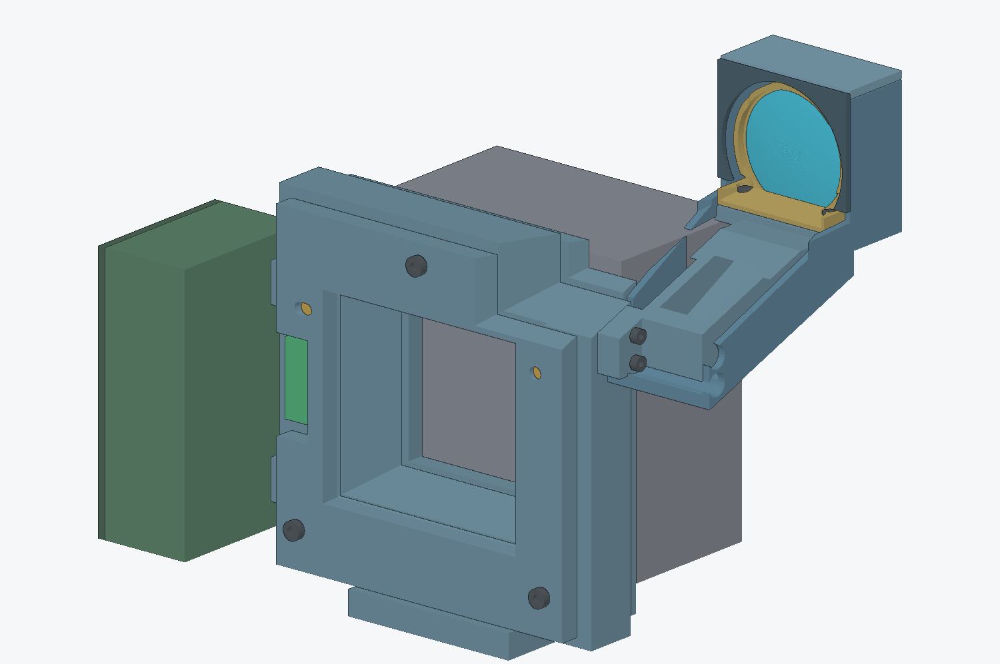

# Modular Medium Format Camera

An experimental modular medium-format digital camera platform exploring and documenting mechanical, optical, interface, and system-level design.



> **Project status:** Pre-prototype / Simulation  
> This project is under active development. Current dimensions, architectures, and design decisions are not manufacturing-ready specifications.  
> **Public scope:** This repository contains curated public development records and may intentionally lag behind private internal development.

## Overview

The goal of this project is to develop a modular medium-format camera platform built around interchangeable subsystems rather than a single fixed camera design.

The project explores:

- modular digital-back interfaces
- interchangeable lens and front modules
- direct optical viewfinder systems
- structural datum and alignment architectures
- mechanical tolerance and repeatability
- early electronic system integration

The project is currently focused on architecture development, simulation, and interface validation.

## Development Philosophy

This repository documents not only successful designs, but also rejected concepts, simulation results, engineering trade-offs, and design decisions.

The intention is to preserve the complete development history from early concepts to working prototypes.

## Current Stage

**Phase: Pre-prototype / Simulation**

Current work includes:

- system architecture
- mechanical interface development
- optical viewfinder and frameline development
- tolerance analysis
- modular body structure
- front-module closure / retention studies
- electronics / control architecture

No design is currently considered production-ready or manufacturing-frozen.

## Documentation

Start here:

- [Current Project State](docs/overview/current-state.md)
- [Subsystem Status Matrix](docs/overview/subsystem-status.md)
- [System Architecture Overview](docs/architecture/system-overview.md)
- [Electronics & Control Architecture](docs/architecture/electronics-control-overview.md)

### Design Decisions

- [DD-001 — Modular Camera Platform Architecture](docs/design-decisions/DD-001-modular-platform-architecture.md)
- [DD-002 — Separate Positioning, Seating, and Clamping Functions](docs/design-decisions/DD-002-separate-positioning-seating-clamping.md)

### Development History

- [BODY2_REV05 — Architecture Integration](docs/development-log/body2-rev05-architecture-integration.md)
- [FM2_CLOSURE03 — Digital Closure Review](docs/development-log/fm2-closure03-digital-closure-review.md)
- [VF13_FRAME_ARCH01 — Frameline Architecture Study](docs/development-log/vf13-frameline-architecture.md)
- [Viewfinder, HUD, and Frameline Evolution](docs/development-log/viewfinder-hud-frameline-evolution.md)
- [Development Log](docs/development-log/README.md)
- [Project Evolution — September 2026](docs/development-log/2026-09-project-evolution.md)
- [Revision History](docs/development-log/revision-history.md)

## Repository Structure

```text
modular-medium-format-camera/
├── docs/
│   ├── architecture/
│   ├── design-decisions/
│   ├── development-log/
│   └── overview/
│
├── images/
│   ├── history/
│   └── renders/
│
├── .gitignore
├── PUBLIC_RELEASE_POLICY.md
└── README.md
```

## Release Policy

See [Public Release Policy](PUBLIC_RELEASE_POLICY.md) for the repository's public/private release boundaries and review rules.

## Licensing

No license is currently granted for the design files or engineering documentation in this repository.

Licensing and possible future open-hardware release terms remain under consideration.
