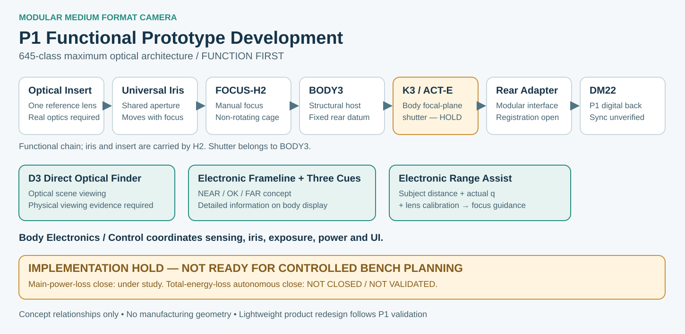

# Modular Medium Format Camera

**Current phase: P1 Functional Prototype Development**

An experimental modular medium-format digital camera project. P1 aims to build and verify the first working camera through the complete shooting chain, from optical viewing and manual focus to exposure, controlled closing and an image saved by the digital back.

*Current functional relationships, not a physical prototype photograph or a manufacturing drawing. All subsystems still require physical verification.*

> **Current gate:** P1-01 shutter **IMPLEMENTATION HOLD — NOT READY FOR CONTROLLED BENCH PLANNING**.  
> No complete working prototype, working shutter, validated lens or iris, or fully compatible DM22 interface is claimed. No manufacturing or production release is implied.  
> **P1 principle: FUNCTION FIRST.** Lightweight product optimization is intentionally deferred until after P1 validation.

## Current architecture

The maximum optical architecture is **645-class**. BODY3 replaces BODY2 as the current body direction; 6×7 is no longer the body target.

**Optical Insert → Universal Iris → FOCUS-H2 → BODY3 → K3 / ACT-E Focal-Plane Shutter → Rear Datum / Adapter → DM22**

This is a functional chain: the iris and lens insert are carried by the non-rotating moving optical cage within H2; the shutter belongs to BODY3. It is not a literal sequence of separate optical elements.

| Subsystem | P1 role and evidence boundary |
| --- | --- |
| Optical Insert | A small lensboard-like carrier; initially one reference lens only. Real lens geometry, registration and locking remain open. |
| Universal Iris | A shared aperture inside the moving optical cage, moving with focus. The actual iris mechanism is not yet implemented. |
| FOCUS-H2 | Large-diameter manual focus mechanism with a non-rotating moving optical cage and direct measurement of actual lens position, q. Real motion and sensing need implementation. |
| BODY3 | Structural host retaining a fixed rear datum, modular rear adapter and D3 shoulder finder. Strength, joints and practical service still need evidence. |
| K3 + ACT-E | Flexible dual-curtain focal-plane shutter with direct closed-loop electric drive. Latest P1-01 IMPL02 retains a right-side drive candidate and optical / coded direct bar reference candidate; implementation remains on HOLD. |
| Rear interface / DM22 | DM22 is the P1 digital back, with its own power, processing and storage. True mounting datum, registration, locking and synchronization are not fully verified. |

Parallel functions are **D3 Direct Optical Finder**, **Electronic Frameline**, **Three Focus Cue Lights** (NEAR / OK / FAR concept), **Electronic Range Assist**, and **Body Electronics / Control**. D3 provides the optical scene. Independent ranging, actual q and lens calibration inform focus guidance. Detailed information belongs on the body display; a full HUD is outside the current direction.

## What is still blocked

Shutter implementation, controlled closing, power / safe power, assembly and maintenance paths remain unresolved. Main-power-loss controlled close is an architecture under study; total-energy-loss autonomous mechanical close is **NOT CLOSED / NOT VALIDATED**.

H2 motion and q sensing, the actual universal iris, Optical Insert datums / locking and real lens data, DM22 registration / sync, and physical electronics / range / UI implementation also remain open. CAD checks and simulations do not establish physical performance.

P1 can be heavier and larger, use larger actuators and boards, external development power, and ordinary prototype materials. Function, adjustability, repeatability, safety and serviceability take priority over weight, appearance and product packaging. Portability is **DEFERRED PRODUCT OPTIMIZATION**, not a solved requirement. Magnesium, CFRP and hybrid structures are possible post-P1 research directions; no GEN1-L CAD or completed lightweight design is introduced.

## Read the project in five minutes

1. [Current state](docs/overview/current-state.md) — phase, current configuration and blockers.
2. [System architecture](docs/architecture/system-overview.md) — subsystem relationships and a concept view.
3. [Subsystem status](docs/overview/subsystem-status.md) — evidence levels and next gates.
4. [Physical validation roadmap](docs/overview/physical-validation-roadmap.md) — P1-01 through P1-07; an evidence sequence, not a calendar schedule.
5. [P1 transition](docs/development-log/p1-functional-prototype-transition.md) — why BODY2 / FM-C gave way to BODY3 / P1.

Further detail: [Electronics and control](docs/architecture/electronics-control-overview.md), [function-first decision](docs/design-decisions/DD-003-p1-function-first.md), [modularity](docs/design-decisions/DD-001-modular-platform-architecture.md), [positioning / seating / clamping](docs/design-decisions/DD-002-separate-positioning-seating-clamping.md), and [public graphics](images/renders/README.md).

## Development history

[Development log](docs/development-log/README.md) · [Revision history](docs/development-log/revision-history.md) · [September evolution](docs/development-log/2026-09-project-evolution.md)

BODY2_REV05, BODY2_TOL01, FM2 / FM-C, relay / SIDE / HUD / VF studies and the SYS electronics studies remain available as history. The old Copal-in-each-lens front architecture is **SUPERSEDED / HISTORICAL**. Its failed closure studies are preserved; they do not describe the active front end.

## Public scope and licensing

This is an **open-development, controlled-release documentation repository**. It publishes curated architecture, history and sanitized diagrams under the [Public Release Policy](PUBLIC_RELEASE_POLICY.md). Complete CAD, manufacturing geometry, parameter registers, optical prescriptions, simulation sources, detailed interface data and third-party manuals are excluded.

Publication does not grant a license to manufacture or reuse the designs. Licensing and possible future open-hardware terms remain under consideration.
