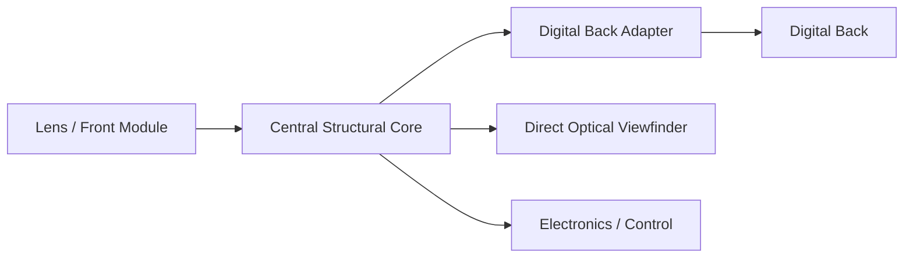

# System Architecture Overview

> **Status:** CANDIDATE / SIMULATION  
> **Development stage:** Pre-prototype  
> **Last updated:** September 2026

## Purpose

This document describes the current high-level architecture of the Modular Medium Format Camera project.

The system is designed as a modular camera platform rather than a single fixed camera body. Major functional and structural subsystems are intended to remain independently replaceable where practical.

The architecture is still under development and should not be treated as a manufacturing specification.

## High-Level System

The current camera concept is divided into several major subsystems:

## System Diagram

1. Central structural core
2. Rear digital-back interface
3. Front / lens module interface
4. Optical viewfinder system
5. Mechanical datum and clamping architecture
6. Electronics / control subsystem

Each subsystem is intended to have a clearly defined mechanical and functional interface.

## Central Structural Core

**Status:** CANDIDATE

The central core acts as the primary structural reference for the camera.

Its intended functions include:

- maintaining alignment between front and rear modules
- supporting the digital-back interface
- supporting the front optical module
- carrying the viewfinder structure
- providing reference geometry for future accessories and electronics

The current geometry remains under simulation and has not been manufacturing-frozen.

## Rear Digital-Back Interface

**Status:** CANDIDATE / SIMULATION

The rear interface is intended to allow different digital backs or adapter plates to be attached to the camera core.

Primary design goals include:

- repeatable positioning
- controlled axial seating
- minimal alignment shift after removal and reinstallation
- independent positioning and clamping functions
- replaceable adapter architecture

The final locking mechanism and physical interface geometry remain under development.

## Front / Lens Module Interface

**Status:** CONCEPT / CANDIDATE

The front interface is intended to support interchangeable optical modules.

Possible modules may include:

- conventional lens mounts
- fixed-lens modules
- bellows-based systems
- experimental shutter assemblies

The final interface standard has not yet been selected.

## Optical Viewfinder

**Status:** CANDIDATE / SIMULATION

The current architecture uses a direct optical viewfinder integrated into the camera structure.

Design goals include:

- comfortable eye position
- useful field coverage
- compact packaging
- compatibility with multiple optical modules
- minimal interference with the camera body and user ergonomics

Several optical configurations have been evaluated, including rejected and retained candidates.

Physical optical bench validation has not yet been completed.

## Mechanical Datum Architecture

**Status:** CANDIDATE / SIMULATION

A central design principle of the project is to separate:

- positioning
- axial seating
- clamping

where practical.

This is intended to improve repeatability and reduce the influence of clamping force on module alignment.

Tolerance simulations are currently being used to evaluate the effectiveness of this architecture.

## Electronics

**Status:** EARLY SYSTEM DEVELOPMENT

Electronics are not currently the primary development focus. Early system-level work has begun around power, I/O, user-interface, and subsystem-interface definition, while implementation remains secondary to mechanical and optical validation.

Potential functions include:

- shutter control
- digital-back communication
- exposure control
- power management
- viewfinder information
- accessory interfaces

The mechanical architecture is being developed so that electronic systems can evolve without requiring a complete redesign of the camera platform.

## Architecture Principles

The current development follows several general principles:

- modularity
- replaceable interfaces
- separation of positioning and clamping
- documentation of rejected concepts
- simulation before manufacturing
- progressive validation
- preservation of design history

## Current Validation Level

The current architecture is primarily supported by:

- CAD development
- geometric studies
- optical simulation
- tolerance simulation
- interface analysis

It has not yet been validated as a complete physical camera system.

## Related Documents

- [Current Project State](../overview/current-state.md)
- [DD-001 — Modular Camera Platform Architecture](../design-decisions/DD-001-modular-platform-architecture.md)
- [DD-002 — Separate Positioning, Seating, and Clamping Functions](../design-decisions/DD-002-separate-positioning-seating-clamping.md)
- [BODY2_REV05 — Architecture Integration](../development-log/body2-rev05-architecture-integration.md)
- [Public Release Policy](../../PUBLIC_RELEASE_POLICY.md)

Future public documents may cover individual subsystems in greater detail as they are reviewed for release.
