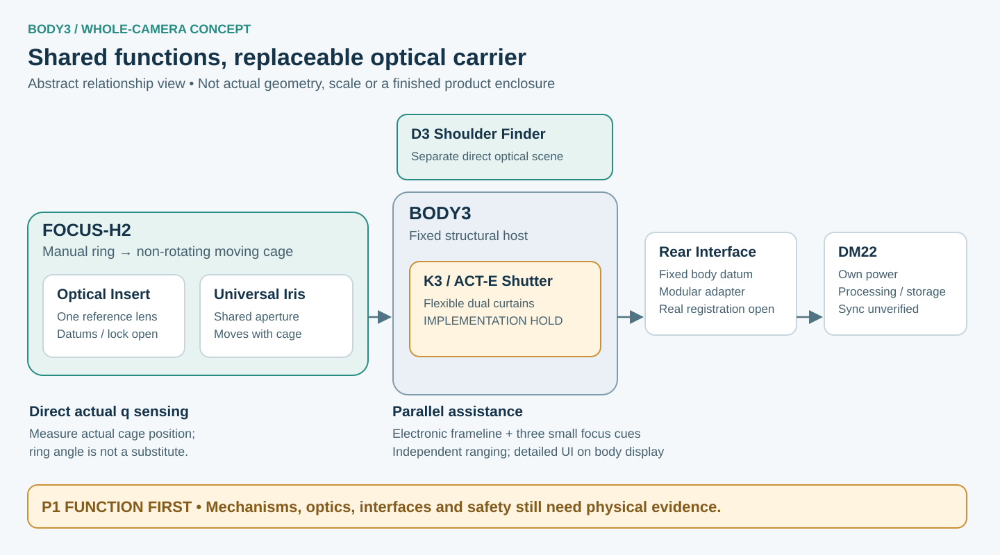

# System Architecture Overview

> **Current phase:** P1 Functional Prototype Development  
> **Direction:** 645-class maximum optical architecture / BODY3  
> **Evidence:** Architecture, CAD and simulation; complete physical system not verified  
> **Updated:** 2026-09-28

P1 is intended to demonstrate the complete camera function before product weight and packaging optimization. This page describes the current functional responsibilities, not released geometry or compatibility.

## System diagram

~~~mermaid
%%{init: {"theme": "neutral", "fontFamily": "Arial", "flowchart": {"wrappingWidth": 220}}}%%
flowchart LR
    subgraph Imaging["Imaging and structural relationships"]
        direction TB
        OI["Optical Insert - one reference lens"] --> IR["Universal Iris - shared and moving"]
        IR --> H2["FOCUS-H2 - manual focus / non-rotating cage"]
        H2 --> B3["BODY3 - structural host"]
        B3 --> SH["K3 / ACT-E focal-plane shutter - IMPLEMENTATION HOLD"]
        SH --> RA["Fixed rear datum / modular adapter"]
        RA --> DM["DM22 - registration / sync unverified"]
    end
    subgraph Viewing["Parallel optical viewing and assistance"]
        direction TB
        SC["Scene"] --> D3["D3 Direct Optical Finder"]
        D3 --> EYE["Optical scene to eye"]
        RANGE["Independent electronic ranging"] --> CTRL["Body Electronics / Control"]
        Q["Direct actual q measurement"] --> CTRL
        CAL["Reference lens calibration"] --> CTRL
        CTRL --> FRAME["Electronic Frameline - implementation required"]
        CTRL --> CUES["Three Focus Cue Lights - NEAR / OK / FAR concept"]
        FRAME -.-> EYE
        CUES -.-> EYE
        CTRL --> UI["Body display - detailed information"]
    end
~~~

The imaging chain shows responsibilities, not optical-element order or an assembly procedure. The iris and Optical Insert reside in the moving H2 optical cage; the shutter is body-mounted. The parallel control branch receives actual H2 q and coordinates the shutter, iris and DM22 synchronization boundary. Dashed links to the eye indicate intended display assistance, not verified optical hardware. The rear datum remains part of the fixed body structure, independent of the removable shutter.

*Conceptual arrangement only: no scale, manufacturing dimensions, optical prescription or finished enclosure is represented.*

## BODY3 and the rear boundary

BODY3 supersedes BODY2 as the structural direction. It carries the front focusing system, D3 shoulder finder and body-mounted shutter while retaining a fixed rear datum and a modular rear adapter. The maximum optical architecture is 645-class; earlier 6×7 ambitions do not define the current body.

Structural CAD continuity and selected packaging checks support further detail work. They do not prove frame strength, joints, manufacturability or real assembly. Ordinary shutter service must preserve the fixed rear datum. P1 may use staged tool-assisted service; complete cassette removal is not assumed possible merely because a final installed model exists.

DM22 is the current P1 back. Its true mount datum, seating, registration, locking, safe removal and synchronization require real evidence. The back retains its own power, image processing and storage. An external envelope or synchronization model cannot establish full compatibility.

## FOCUS-H2, Universal Iris and Optical Insert

FOCUS-H2 is the current front direction: a large-diameter manual focusing mechanism converts ring input into axial movement of a non-rotating optical cage. Actual cage / lens displacement is called **q**. Direct q measurement is required; ring angle alone is not evidence of actual lens position.

The shared Universal Iris is inside this moving cage and moves with the optical groups during focusing. Its actual blades, actuation, aperture feedback and service connections remain to be implemented. The real reference lens must be compatible with that shared aperture relationship; compatibility cannot be created by assigning an identity or calibration profile to placeholder geometry.

The intended user-replaceable Optical Insert resembles a mini large-format lensboard. Each insert does not carry a complete focusing mechanism, shutter and electronics system. GEN1 / P1 begins with **one reference lens**, not universal lens compatibility. Real optical geometry, datums, captured locking, repeatable seating and light-safe exchange remain open.

## Body-mounted shutter

The current direction is **K3 flexible dual-curtain + ACT-E direct closed-loop electric drive**. P1-01_SHUTTER_IMPL02 is the latest applicable shutter milestone. It retains a right-side drive arrangement and an optical / coded direct bar reference candidate, with independent endpoint evidence still required. Direct curtain-bar sensing and H2 q sensing are separate functions.

**IMPLEMENTATION HOLD — NOT READY FOR CONTROLLED BENCH PLANNING.** Assembly and bearing service are not closed; hard interferences and incomplete safety mechanisms remain. Main-power-loss controlled close is an architecture under study. Total-energy-loss autonomous mechanical close is **NOT CLOSED / NOT VALIDATED**. No working shutter, exposure performance or speed capability is claimed.

## D3, framing and focus guidance

D3 retains direct optical scene viewing. The current information concept is an **electronic frameline plus three small focus cue lights: NEAR / OK / FAR**. Detailed settings and fault information belong on the body display. This does not reopen a full HUD.

An independent electronic ranging subsystem supplies subject-distance information. Body control compares distance, actual q and the appropriate lens calibration to provide guidance. Calibration validity and measurement freshness matter; unknown inputs must not produce a false OK cue. This is manual focusing assistance, not a physically verified autofocus system.

The earlier VF13 fixed-brightline study remains useful principle evidence, but it is not an implemented electronic frameline. D3 optical performance, frameline visibility, cue visibility, alignment and eye-position behavior still need physical validation.

## P1 priorities and release boundary

Function, adjustability, repeatability, safety and serviceability take priority over weight, industrial design and product packaging. Larger hardware, local packaging exceptions and external development power are acceptable candidates when their effects are documented; these allowances do not resolve safety or datum requirements.

Lightweight product optimization is deferred until after P1 validation. Magnesium, CFRP and hybrid structures remain possible later research; they are not designed material substitutions. No parallel GEN1-L CAD is introduced.

Source basis: CAMERA_P1_BASELINE01 system / status / blocker registers, CAMERA_GEN1_COMPACT01 integration and portability reviews, and P1-01_SHUTTER_IMPL02 gate / placement / sensing / safety reviews. These are private engineering sources, summarized here under the [release policy](../../PUBLIC_RELEASE_POLICY.md).

## Related documents

- [Current state](../overview/current-state.md)
- [Subsystem status](../overview/subsystem-status.md)
- [Evidence roadmap](../overview/physical-validation-roadmap.md)
- [Electronics and control](electronics-control-overview.md)
- [P1 transition and superseded architecture](../development-log/p1-functional-prototype-transition.md)
