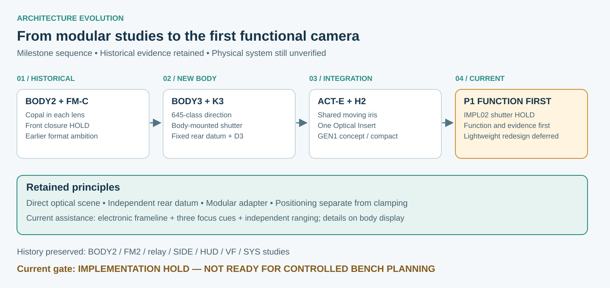

# P1 Functional Prototype Transition

> **Record:** Public architecture transition  
> **Current phase:** P1 Functional Prototype Development  
> **Status:** CURRENT P1 DIRECTION; physical system verification incomplete  
> **Updated:** 2026-09-28

The project now prioritizes the first camera that can complete a real shooting cycle. BODY3 / P1 supersedes the former BODY2 / FM-C architecture as the active mainline. Earlier studies and their failures remain development history.

## Old public state to current P1 state

| Earlier public direction | Current P1 direction | Historical treatment |
| --- | --- | --- |
| BODY2_REV05 structural integration | BODY3 with fixed rear datum, modular adapter, D3 and body shutter | BODY2 studies preserved; not the current body |
| Earlier 6×7 ambition | 645-class maximum optical architecture | Scope narrowed; no wider-format compatibility claim |
| FM2 / FM-C and Copal shutter in each lens | H2 shared focusing, moving universal iris, Optical Insert and body-mounted shutter | SUPERSEDED / HISTORICAL HOLD |
| Spring-based ACT-S exposure drive | ACT-E direct closed-loop electric drive with K3 flexible dual curtains | ACT-S reference only; safety bias is a separate function |
| VF13 fixed-brightline-first study | Electronic frameline + three focus cue lights as requirements | Principle evidence retained; not electronic implementation proof |
| SYS architecture / software baseline | P1 electronics, safe power, ranging and control hardware work | History retained; conflicting old assumptions superseded |
| Portability as product gate | FUNCTION FIRST; lightweight redesign after P1 | Product optimization deferred, not solved |

## Why leave FM-C and the Copal front architecture?

FM2_CLOSURE03 did not close its integrated retention, preload, safety, service and lens-envelope problems even at the digital-design level. It was not merely awaiting routine physical confirmation. P1 does not continue that front mechanism.

Moving the shutter to the body and sharing focus and iris functions changes the optical module's responsibility: the user is intended to exchange a lensboard-like Optical Insert rather than another complete focus / shutter / electronics assembly. This is a project architecture choice, not evidence that leaf shutters are generally unsuitable. GEN1 begins with one reference lens; the new arrangement does not promise broad compatibility.

## Why BODY3 and 645-class?

BODY3 provides a structural route for a body-mounted shutter while keeping the rear datum independent of the shutter and retaining D3. The new shutter bay, load path and service responsibilities require a new body architecture; they are not a small extension to BODY2.

The maximum optical scope is now 645-class, replacing the earlier 6×7 body ambition. This narrows the integration problem around the current first-camera objective. It does not establish that a smaller format automatically solves shutter, optical or packaging problems; no quantified performance benefit is claimed without evidence.

See [BODY3 development](body3-development.md) for the distinction between architecture candidates, structural packaging holds and actual physical validation.

## K3 and the ACT-S → ACT-E change

K3 retains a flexible dual-curtain approach, with curtain motion monitored at the bars. Earlier kinematic and mechanical studies exposed incomplete drive, braking, capture, reset and mounting arrangements. Their digital evidence does not constitute a working shutter.

The actuation comparison selected ACT-E as the next mainline because controlled electric trajectories can simplify the normal high-speed brake / capture / reset-clutch chain. The alternative spring-based route retained unresolved mechanical-chain problems. ACT-E introduces its own actuator, sensing, power, thermal and safe-closing burdens; the initial small actuator assumptions were not hardware proof.

SHUTTER04 added realistic implementation constraints and retained an implementation / safe-closure HOLD. P1-01 IMPL01 explored the function-first implementation; IMPL02 now retains a right-side drive arrangement and an optical / coded direct bar reference candidate. **IMPLEMENTATION HOLD — NOT READY FOR CONTROLLED BENCH PLANNING** remains the latest state.

A passive bias considered for emergency closure does not restore ACT-S as the primary exposure drive. Main-power-loss controlled closing is under study. **Total-energy-loss autonomous mechanical close is NOT CLOSED / NOT VALIDATED.** See [shutter development](shutter-architecture-development.md).

## H2, the shared iris and Optical Insert

FOCUS-H2 uses a large-diameter manual-focus input and a non-rotating moving optical cage. Actual q must be measured directly. The universal iris belongs inside the cage and moves with the lens during focus.

The Optical Insert is the replaceable optical carrier. Its real reference-lens geometry, optical stop relationship, registration, datums and locking remain unresolved. H2 structure and iris packaging envelopes are not working mechanisms; an optical placeholder is not a validated lens.

## D3 and electronic assistance

D3 remains the direct optical scene path. The intended information layer is electronic frameline plus three small NEAR / OK / FAR cue lights, with detailed information on the body display. Independent electronic ranging compares subject distance with actual q and lens calibration to guide manual focus. No full HUD is reopened, and no physically verified electronic frameline or range performance is claimed.

## Why P1 is function first

Whole-camera concept integration made the coupled function and packaging problems visible. COMPACT01 recovered native CAD delivery and explored mass / envelope changes, yet did not close the lightweight product gate or the functional subsystems. CAMERA_P1_BASELINE01 therefore separates the first functioning prototype from the later optimized product.

Function, adjustability, repeatability, safety and serviceability take priority over weight, appearance and packaging. P1 may be larger and heavier, use larger actuators / boards, external development power and ordinary aluminum / steel / standard hardware. Safety and datum integrity remain required. Staged tool-assisted maintenance may replace a product-oriented complete-cassette service target, but it still needs a real path.

Portability is **DEFERRED PRODUCT OPTIMIZATION**, not an achieved result. Magnesium, CFRP and hybrid structures are only possible post-P1 research directions requiring redesign and new evidence. No GEN1-L CAD or completed lightweight material design is introduced.

## Current blockers and next sequence

Shutter drive / packaging, controlled close, main / safety power and assembly / maintenance remain blocked. H2 motion and q sensing, the actual universal iris, Optical Insert retention and real lens geometry, DM22 registration / locking / sync, physical D3 / framing / ranging and electronics / UI also require implementation and evidence.

P1-01 shutter precedes P1-02 H2, P1-03 iris / insert, P1-04 DM22, P1-05 electronics / power / range / UI, P1-06 integration and P1-07 controlled bench / prototype release planning. This is an [evidence roadmap](../overview/physical-validation-roadmap.md), not a calendar schedule or current release authorization.

## Source and publication scope

This sanitized record uses the supplied CAMERA_P1_BASELINE01 system, requirements, status and blocker documents; COMPACT01 native-integration / portability reports and preserved concept records; SHUTTER04 and P1-01 IMPL01 / IMPL02 gates. Historical BODY3 and SHUTTER01–03 gate records referenced by those packages establish the development sequence. Exact milestone dates and unsupported performance claims are not inferred.

Source engineering packages, dimensions, interface coordinates, load tables, safety parameters and optical prescriptions remain private under the [Public Release Policy](../../PUBLIC_RELEASE_POLICY.md).

- [Current state](../overview/current-state.md)
- [Revision history](revision-history.md)
- [September evolution](2026-09-project-evolution.md)
- [Function-first decision](../design-decisions/DD-003-p1-function-first.md)
