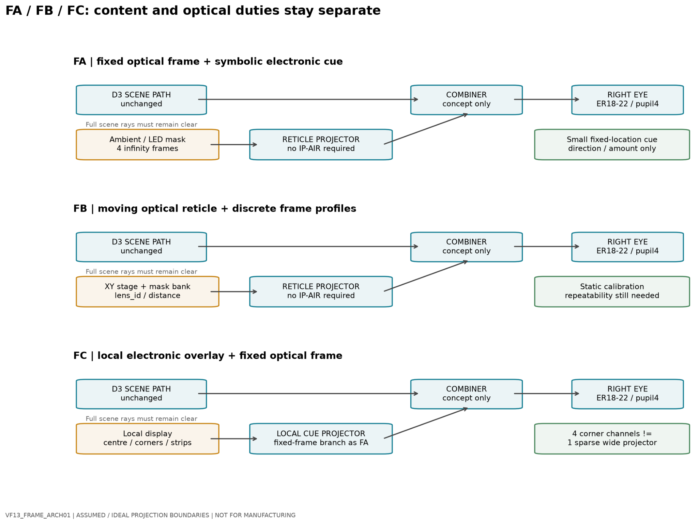

# VF13_FRAME_ARCH01 — Frameline Architecture Study

> **Status:** PRINCIPLE-VALIDATION CANDIDATE / SIMULATION  
> **Development stage:** Pre-prototype  
> **Validation:** Numerical and architecture study only  
> **Date:** September 2026

VF13_FRAME_ARCH01 extends the direct-view finder development path with a dedicated study of frameline and cue architectures.

This public document is a sanitized summary. Detailed optical parameters, actuator budgets, packaging dimensions, and internal source data remain outside the public repository.

---

## Objective

The study compared several ways to add framing information to the retained direct optical finder while preserving the direct-view scene.

The main architecture families considered were:

- fixed optical framelines
- movable or profile-selectable framelines
- small electronic cue regions

The goal was to identify the lowest-complexity path suitable for independent principle validation before any camera-body packaging is frozen.

*Conceptual VF13 architectures: fixed framelines with symbolic cues (FA), movable reticles (FB), and local electronic overlays (FC); assumed projection boundaries, not a validated optical design.*

---

## Retained Direction

The currently retained public direction is a staged approach.

### Initial principle-validation path

A fixed optical brightline branch is preferred for the first independent test article.

This path preserves the direct-view scene and minimizes dependence on:

- moving optical elements
- active position control
- continuous scaling
- complex display hardware

Small directional or status cues may be added later without turning the finder into a full-field electronic display.

### Later development

A movable or profile-selectable frameline architecture remains a possible later-generation study if closer-range framing accuracy proves necessary.

Multi-channel corner or edge-display architectures are not currently prioritized.

---

## Why This Direction Was Chosen

The study found that reducing displayed content does not automatically eliminate optical aperture and eye-position requirements.

A small central cue can use a much smaller active region, while a complete frameline still spans a large angular field and therefore remains an optical-system problem rather than merely a display problem.

The staged approach therefore separates:

- direct-view scene quality
- fixed framing visibility
- optional cue information
- later dynamic correction

This reduces the number of coupled problems that must be solved in the first physical experiment.

---

## Interface Status

Functional responsibilities can now be described at a high level.

The frameline subsystem should support:

- a stable reference to the calibrated finder structure
- removable service access
- independent frameline and cue enable/disable behavior
- calibration references
- future access to lens identity and distance validity where needed

However, the following remain intentionally unfrozen:

- module envelope
- mounting geometry
- optical-window geometry
- connector details
- actuator selection
- electrical implementation
- manufacturing tolerances

No camera-body cutout or module bay is released by this study.

---

## Validation Performed

The study included:

- comparison of several frameline architectures
- numerical field and registration studies
- eye-position sampling
- optical-boundary studies
- interface-responsibility definition
- software verification of the numerical workflow

These checks support continued architecture work.

They do not demonstrate:

- a validated projector or combiner
- ghost-free performance
- brightness or contrast performance
- physical eye-box performance
- camera-body packaging
- human-factors acceptance
- manufacturing readiness

---

## Current Gate

The next useful step is an **independent fixed-brightline principle prototype**.

That experiment should evaluate:

- frameline visibility
- apparent focus
- full-frame visibility across intended eye positions
- ghosting and stray reflections
- practical alignment and calibration

Only after that experiment should more complex dynamic frameline mechanisms be reconsidered.

---

## Related Documents

- [System Architecture Overview](../architecture/system-overview.md)
- [Current Project State](../overview/current-state.md)
- [BODY2_REV05 — Architecture Integration](body2-rev05-architecture-integration.md)
- [Revision History](revision-history.md)
- [Public Release Policy](../../PUBLIC_RELEASE_POLICY.md)
