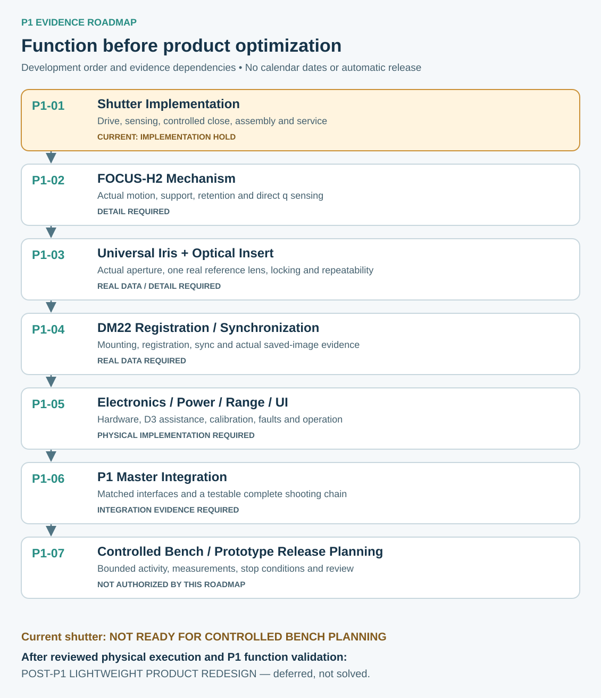

# Physical Validation Roadmap

> **Current phase:** P1 Functional Prototype Development  
> **Roadmap type:** Evidence sequence, not a calendar schedule  
> **Current gate:** P1-01 IMPLEMENTATION HOLD — NOT READY FOR CONTROLLED BENCH PLANNING  
> **Updated:** 2026-09-28

P1 aims to demonstrate a complete working camera before lightweight product redesign. The sequence below follows CAMERA_P1_BASELINE01, with the shutter entry updated by P1-01_SHUTTER_IMPL02. It replaces the former BODY2 / FM-C validation sequence.

~~~mermaid
%%{init: {"theme": "neutral", "fontFamily": "Arial", "flowchart": {"wrappingWidth": 280}}}%%
flowchart TD
    P01["P1-01 Shutter Implementation - current HOLD"] --> P02["P1-02 FOCUS-H2 Mechanism"]
    P02 --> P03["P1-03 Universal Iris + Optical Insert"]
    P03 --> P04["P1-04 DM22 Registration / Synchronization"]
    P04 --> P05["P1-05 Electronics / Power / Range / UI"]
    P05 --> P06["P1-06 P1 Master Integration"]
    P06 --> P07["P1-07 Controlled Bench / Prototype Release Planning"]
    P07 --> TEST["Separately reviewed physical execution and evidence"]
    TEST --> VALID["Complete P1 function validation"]
    VALID --> LIGHT["Post-P1 lightweight product redesign"]
~~~

Arrows show the main development and evidence dependency order, not dates or automatic approvals. Preparation can expose downstream unknowns early; provisional inputs cannot be treated as closed interfaces. A serious architecture finding can justify a documented sequence review. Weight alone does not change this sequence.

Each stage must distinguish completed design evidence, required physical measurements and tests that have not been executed. Limited subsystem tests, if separately reviewed and permitted, do not imply an integrated prototype release. P1-07 reviews the controlled execution plan; its presence on this roadmap is not permission to start now.

## P1-01 — Shutter Implementation

**Current evidence:** K3 / ACT-E candidate, right-side drive arrangement and optical / coded direct bar sensing candidate. IMPL02 reports local installed-state improvements alongside hard interferences, incomplete assembly / bearing service and incomplete safe closing.

**Required evidence:** actual moving-load and actuator behavior; implementable transmission / supports; direct bar feedback and independent endpoints; complete assembly and maintenance routes preserving fixed datums; real main / safety power and fault behavior. Main-power-loss controlled closing and total-energy-loss autonomous closing must be evaluated separately.

**Exit gate:** an implementation and safety review can support a bounded, measurable next validation plan with unresolved conditions explicitly recorded. No numeric shutter speed, closing time or safety performance is released here. **NOT READY FOR CONTROLLED BENCH PLANNING** remains the current result.

## P1-02 — FOCUS-H2 Mechanism

**Current evidence:** large-diameter manual-focus and non-rotating cage architecture, structural candidates and selected digital motion checks. Smooth functional envelopes are not a working motion mechanism.

**Required evidence:** actual motion pair, bearings / support, anti-rotation, axial retention, assembly, torque / backlash / repeatability and direct q sensing integration. The mechanism must fit the applicable shutter and body boundaries.

**Exit gate:** a concrete P1 motion implementation with inspectable assembly and measurement methods. Direct actual cage position must be compared against a reference; ring angle alone is insufficient. Physical results remain unverified until executed.

## P1-03 — Universal Iris + Optical Insert

**Current evidence:** a shared moving iris concept and one reference-lens insert candidate; actual blades, aperture feedback and real optical design remain open.

**Required evidence:** iris motion / aperture / power-loss behavior, moving connections, daily insert exchange versus technical iris removal, positive retention and reinstall repeatability. Real reference-lens geometry must establish aperture-plane compatibility, registration and image-path clearance.

**Exit gate:** one coherent reference-lens / iris / insert implementation and evidence for its defined operations. Missing real optical data keeps the gate open. No second lens or universal compatibility is implied.

## P1-04 — DM22 Registration / Synchronization

**Current evidence:** modular rear interface intent and a reference back envelope. The real mounting datum, lock, register and external synchronization boundary are not fully established.

**Required evidence:** safe external measurements, seating and retention, removal / reinstall behavior, calibrated imaging relationship, supported synchronization and actual saved-image observation. Preserve the fixed body rear datum.

**Exit gate:** a physically grounded registration and synchronization interface, with a safe acquisition validation route. Shutter closed, sync observed and image stored are distinct evidence. Storage may be confirmed by the user on DM22; do not invent an automatic write-complete signal.

## P1-05 — Electronics / Power / Range / UI

**Current evidence:** P1 responsibilities and historical software studies, not current hardware validation. D3 optical viewing remains independent of electronic assistance.

**Required evidence:** body and local shutter control, power / protection / harnesses, calibrated q / distance / lens pairing, iris status, electronic frameline and three cue lights, body display and controls. Verify physical D3 viewing and alignment with a consistent optical configuration. Test data freshness, invalid calibration, faults and ambiguous capture outcomes.

**Exit gate:** real hardware and assistance interfaces with measured behavior and explicit limits. Unknown data must not produce OK or false capture success; a fault must not trigger automatic re-exposure. The historical fixed-brightline study alone does not satisfy electronic frameline implementation.

## P1-06 — P1 Master Integration

**Current evidence:** inherited concept host and configuration baseline; no complete physical camera validation.

**Required evidence:** matching subsystem versions and interfaces, body joint / datum integrity, practical assembly / service, calibration responsibilities and a traceable end-to-end shooting procedure. Keep unexecuted physical checks separate from CAD / software results.

**Exit gate:** a coherent integration candidate whose complete shooting chain and function / safety / repeatability conditions are testable. A master CAD file alone cannot close this gate.

## P1-07 — Controlled Bench / Prototype Release Planning

**Entry:** reviewed implementation and integration evidence, explicit remaining risks, measurement requirements and defined release boundaries.

**Required evidence:** a staged build / assembly / low-energy-motion / exposure plan, equipment and data-recording needs, stop conditions and operating constraints. Numerical acceptance criteria must come from applicable evidence and review, not old modelling assumptions.

**Exit gate:** a bounded release decision for a specific controlled activity. Physical results must then be recorded before claiming P1 validation. This public roadmap does not authorize procurement, manufacture, real-back exposure or safety certification.

## After P1

Only after the functional camera chain is demonstrated should weight, packaging, industrial design and possible magnesium / CFRP / hybrid structures drive product redesign. Current portability limitations remain recorded as **DEFERRED PRODUCT OPTIMIZATION**. No lightweight performance or GEN1-L CAD is claimed.

- [Current state](current-state.md)
- [Subsystem status](subsystem-status.md)
- [P1 transition](../development-log/p1-functional-prototype-transition.md)
- [Public Release Policy](../../PUBLIC_RELEASE_POLICY.md)
